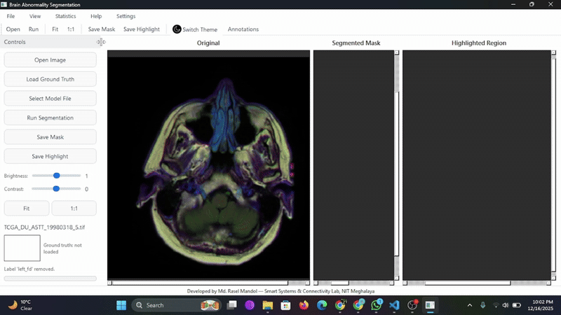
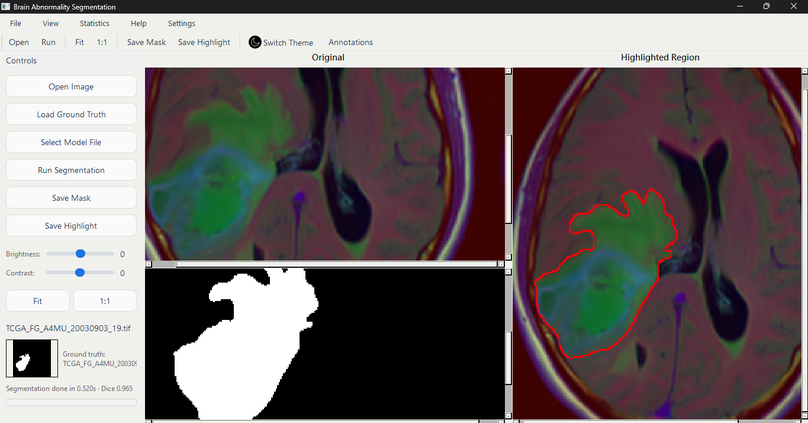
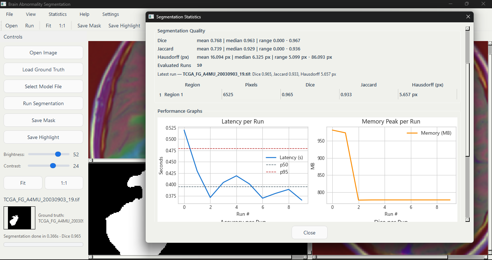
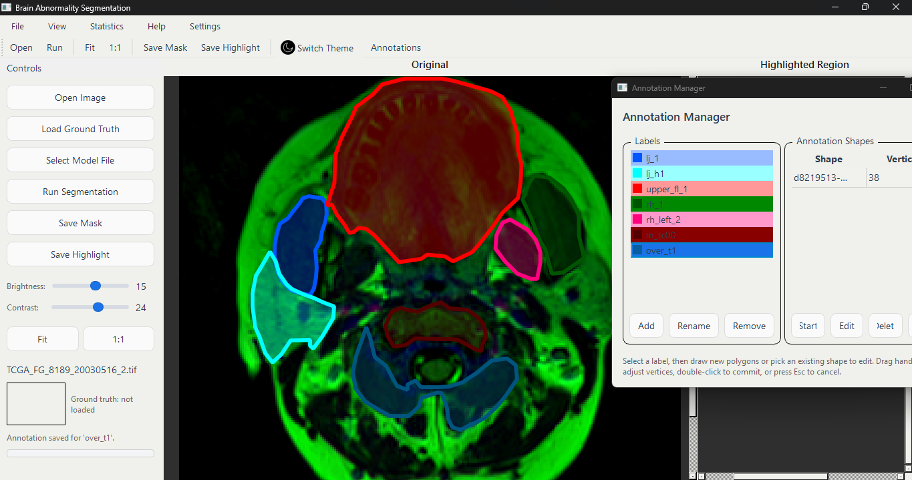
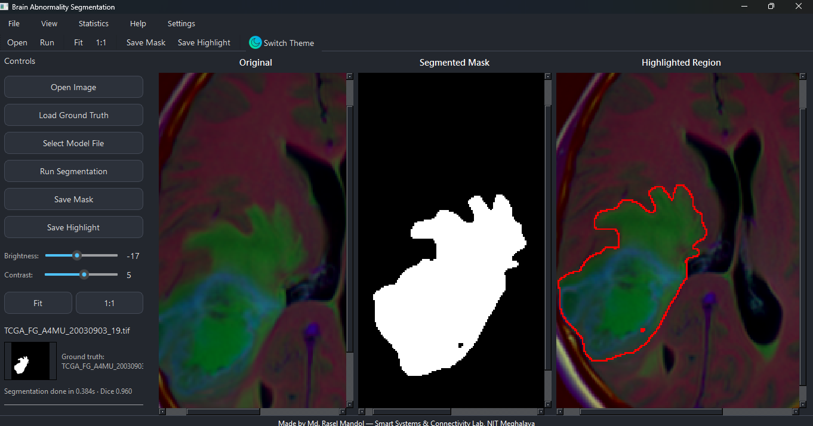
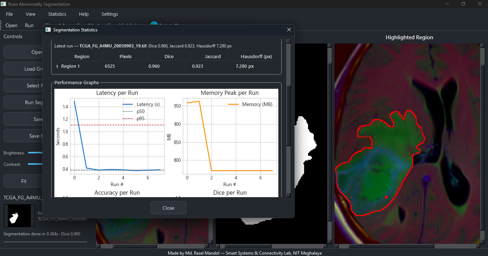

# BrainSeg Screenshots

A compact gallery of the latest BrainSeg UI states. Each capture highlights a specific workflow so you can quickly preview the desktop experience.

## Animated overview

Highlights the streamlined three-panel canvas layout and quick annotation cycle.

## Canvas refinements

Shows the updated left control dock, annotation controls, and stacked original/mask/highlight canvases.

## Statistics dashboard

Displays Dice/Jaccard metrics, latency, and trend charts collected from recent runs.

## Annotation workspace

Focuses on the labeling workflow with active annotations.

## Segmentation workspace

Focuses on the labeling workflow with active annotations and the ground-truth thumbnail strip.

## Statistics legacy view

Presents the earlier dual-pane stats window.
